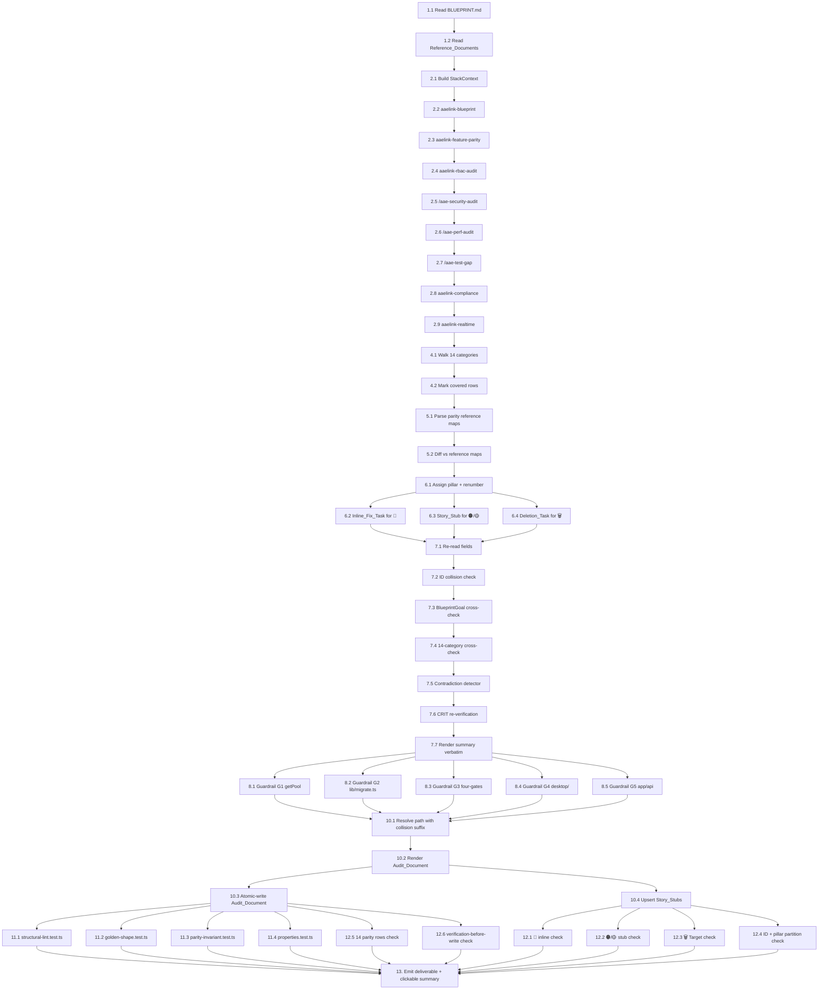

# Implementation Plan: Comprehensive Project Audit (2026-05-25)

## Overview

This plan drives the auditor agent end-to-end through a single audit run that produces `docs/audit-2026-05-25.md`. It is **not** an application-code feature: there is no daemon and no API route. Every task is an in-session operation the auditor performs (read a file, build an in-memory shape, run a skill, render a section, write a deliverable).

The plan follows the 10 phases (A–J) defined in `design.md` and in the user's run brief:

- **Phase A** — Goal extraction (parse `docs/BLUEPRINT.md` into `BlueprintGoal[]`).
- **Phase B** — `Audit_Skill_Chain` (eight skills in fixed order; each emits `Finding[]`).
- **Phase C** — Slack parity rebuild (walk the 14 fixed categories).
- **Phase D** — Cross-validate the rebuilt parity matrix against the two reference sources.
- **Phase E** — Triage Findings (🔴 inline fix tasks, 🟠/🟡 → `.kiro/stories/` stubs, 🗑️ → inline deletion tasks).
- **Phase F** — `Verification_Protocol` (re-read every Finding, goal cross-check, 14-category cross-check, contradiction detector, CRIT re-verification with downgrade-on-fail).
- **Phase G** — Stack-context guardrails pass (G1–G5: `getPool()`, `lib/migrate.ts`, four-gates citation, `desktop/` scope, `app/api/.../route.ts` path).
- **Phase H** — Atomic disk emit (`tmp` + rename) of `docs/audit-2026-05-25.md` (collision suffix `-2`, `-3`, … only if file already exists) plus `Story_Stub` upserts.
- **Phase I** — Test harness execution (structural lint, golden-shape vs `docs/audit-2026-05-19.md`, parity invariant, property-based tests).
- **Phase J** — Final post-checks (every 🔴 has an `Inline_Fix_Task`; every 🟠/🟡 has a stub on disk; every 🗑️ has a concrete target; no ID collisions; 14 parity rows; verification ran before write).

Test files live in `tests/` (project convention — not `__tests__/`). Any test code added MUST pass the four gates (`tsc --noEmit`, `eslint .`, `vitest run`, `next build`) per `.kiro/steering/superpowers.md`.

The deliverable cadence file naming is `docs/audit-2026-05-25.md`. The collision-suffix resolver yields `docs/audit-2026-05-25-2.md`, then `-3.md`, only if a same-day audit already exists on disk (Req 1.3, Req 10.1).

## Tasks

- [ ] 1. Phase A — Extract `BlueprintGoal[]` from the North_Star_Document
  - [x] 1.1 Read `docs/BLUEPRINT.md` end-to-end
    - Confirm the file exists; abort the run if missing (failure-modes table in `design.md`).
    - Extract level-2 and level-3 headings whose text matches `/^(Goal|Requirement|Objective|Capability)/i`.
    - Extract bullets directly under those headings whose text matches `/^MUST|^SHALL|^Provide|^Support/i`.
    - Build `BlueprintGoal[]` in scratch notes with `{ id: stableAnchor, heading, bullet?, source: "docs/BLUEPRINT.md" }`.
    - _Requirements: 2.1, 2.4, 2.5, 8.1_
  - [~] 1.2 Read `docs/ENTERPRISE-BLUEPRINT.md`, `docs/NORTH-STAR-A.md`, and `docs/ROADMAP.yaml` as Reference_Documents only
    - Collect goal-like statements but never add them to `BlueprintGoal[]`.
    - Record any conflicts vs the North_Star_Document for later 🎯 `DRIFT-NNN` emission in Phase B (skill `aaelink-blueprint`).
    - _Requirements: 2.2, 2.3_

- [ ] 2. Phase B — Run the `Audit_Skill_Chain` in fixed order
  - [~] 2.1 Build the immutable `StackContext` payload
    - Populate from `design.md` "Audit_Skill_Chain pipeline" section: framework `Next.js 16`, ui `React 19`, language `TypeScript`, postgres `pg` + `lib/db.ts#getPool()`, migrations `lib/migrate.ts`, test `Vitest`/`Playwright`, editor `Tiptap`, storage `AWS S3`, desktop `desktop/ Electron client`, `apiRouteCount: "~80 route groups"`, `fourGates: ["tsc --noEmit", "eslint .", "vitest run", "next build"]`.
    - Pass deep-equal across every skill invocation (no per-skill mutation).
    - _Requirements: 5.5_
  - [~] 2.2 Invoke `aaelink-blueprint` (chain step 1)
    - Read `.claude/skills/aaelink-blueprint/SKILL.md` and execute its trigger procedure.
    - Use the conflicts collected in 1.2 to emit 🎯 `DRIFT-NNN` Findings against Reference_Documents.
    - Record `Started (UTC)` and `Ended (UTC)` for the Executive Summary skill-chain run-log.
    - On empty stream / exception, emit a synthetic 🔴 `CRIT-NNN` Finding "`Audit_Skill_Chain` step `aaelink-blueprint` produced no output" with `evidence.commandOutput` capturing the trace.
    - _Requirements: 5.1, 5.2, 5.3, 5.4_
  - [~] 2.3 Invoke `aaelink-feature-parity` (chain step 2)
    - Same execution + run-log + failure-mode pattern as 2.2. Findings carry `sourceSkills: ["aaelink-feature-parity"]`.
    - _Requirements: 5.1, 5.2, 5.3, 5.4_
  - [~] 2.4 Invoke `aaelink-rbac-audit` (chain step 3)
    - Same pattern as 2.2.
    - _Requirements: 5.1, 5.2, 5.3, 5.4_
  - [~] 2.5 Invoke `/aae-security-audit` (chain step 4)
    - Same pattern as 2.2. Slash command sourced from `.claude/commands/aae-security-audit.md`.
    - _Requirements: 5.1, 5.2, 5.3, 5.4_
  - [~] 2.6 Invoke `/aae-perf-audit` (chain step 5)
    - Same pattern as 2.2. Slash command sourced from `.claude/commands/aae-perf-audit.md`.
    - _Requirements: 5.1, 5.2, 5.3, 5.4_
  - [~] 2.7 Invoke `/aae-test-gap` (chain step 6)
    - Same pattern as 2.2. Slash command sourced from `.claude/commands/aae-test-gap.md`.
    - _Requirements: 5.1, 5.2, 5.3, 5.4_
  - [~] 2.8 Invoke `aaelink-compliance` (chain step 7)
    - Same pattern as 2.2.
    - _Requirements: 5.1, 5.2, 5.3, 5.4_
  - [~] 2.9 Invoke `aaelink-realtime` (chain step 8)
    - Same pattern as 2.2.
    - _Requirements: 5.1, 5.2, 5.3, 5.4_

- [~] 3. Checkpoint — Skill chain complete
  - Confirm all eight skills logged a `Started (UTC)` and `Ended (UTC)` row.
  - Confirm every emitted Finding has a non-empty `sourceSkills` subset of the canonical chain.
  - Ensure all tests pass; ask the user if questions arise.
  - _Requirements: 5.1, 5.2, 5.4_

- [ ] 4. Phase C — Rebuild the Slack parity matrix from scratch
  - [~] 4.1 Walk the 14 `SLACK_PARITY_CATEGORIES` in fixed order
    - Iterate the constant order from `design.md`: Messaging → File sharing → Notifications → Search → User roles → App/integration → Voice/video → Security/compliance → Mobile/desktop → API/webhook → Emoji/formatting → Pinned/bookmarks → Audit logs → Onboarding.
    - For each category, build at least one `ParityRow` with `{ category, slackCapability, aaelinkStatus, evidence, referenceAgreement: "agree" }` (initial value before cross-validation in Phase D).
    - Sort rows within a category alphabetically by `slackCapability`.
    - _Requirements: 4.1, 4.2, 4.6, 8.2_
  - [~] 4.2 Mark fully covered categories with a `covered` row
    - When a category has full AAELink coverage, emit a single row with `aaelinkStatus = "covered"` and `evidence` pointing at the AAELink implementation (file path or route).
    - _Requirements: 4.3_

- [ ] 5. Phase D — Cross-validate the rebuilt matrix against reference sources
  - [~] 5.1 Parse `docs/parity-slack-mattermost-aaelink-full-map.md` and `docs/parity-reference-matrix.md`
    - Build cell-lookup maps `mapA` and `mapB` keyed by `(category, slackCapability)`.
    - If one source is missing, continue with the other and emit a 🎯 `DRIFT-NNN` flagging the missing source (failure-modes table).
    - _Requirements: 4.4_
  - [~] 5.2 Diff every rebuilt row against the two reference maps
    - For each rebuilt row, compare `aaelinkStatus` against `mapA` then `mapB`.
    - On disagreement, set `referenceAgreement = "disagree-with-<reference-source>"` and emit a ⚖️ `PARITY-NNN` Finding annotated with `disagreement.referenceSource`.
    - Never overwrite the rebuilt status — the rebuilt matrix stays authoritative.
    - _Requirements: 4.4, 4.5_

- [ ] 6. Phase E — Triage Findings into the Seven_Pillars and route remediation
  - [~] 6.1 Assign every Finding to exactly one pillar
    - Assert `pillar` is a singleton from the seven-pillar enum; reject any Finding tagged with two pillars.
    - Renumber prefixes per pillar: `CRIT` → 🔴, `CHG` → 🟠, `UPG` → 🟡, `DEL` → 🗑️, `IMP` → ✅, `PARITY` → ⚖️, `DRIFT` → 🎯. Counter restarts at `001` per prefix per run, ascending.
    - _Requirements: 3.3, 3.5, 8.7_
  - [~] 6.2 Route 🔴 Critical Issues to inline fix tasks
    - Build an `Inline_Fix_Task` block under each 🔴 Finding with concrete edit steps and a final bullet "Re-run four gates (`tsc --noEmit`, `eslint .`, `vitest run`, `next build`)".
    - Do **not** create a Story_Stub for any 🔴 Finding.
    - _Requirements: 6.1, 8.3_
  - [~] 6.3 Route 🟠 Changes Required and 🟡 Upgrades Recommended to `.kiro/stories/` stubs
    - Generate a deterministic slug `lower-kebab(${Finding.id})-${first-6-words-of-title}`, truncated to 80 chars.
    - Render the body from `.kiro/stories/STORY_TEMPLATE.md` with prepended front matter `{ source_finding, pillar, severity, slug, created_at: 2026-05-25 }`.
    - On upsert: if a stub already exists for the same `source_finding`, refresh body but preserve original `created_at`.
    - Embed a relative-path link to the stub under the Finding in the Audit_Document.
    - _Requirements: 6.2, 6.3, 6.5, 6.6, 6.7, 8.4, 10.2_
  - [~] 6.4 Route 🗑️ Deletions to inline deletion tasks
    - Build a `Deletion_Task` block under each 🗑️ Finding naming the exact file path, route, dependency, or feature flag to remove.
    - Include a "Verification after delete: four gates pass" line.
    - _Requirements: 6.4, 8.5_

- [ ] 7. Phase F — Run the `Verification_Protocol` before any disk write
  - [~] 7.1 Re-read every Finding and validate required fields
    - Assert each Finding has non-empty `id`, `title`, `evidence`, `severityRationale`, `recommendation`, `sourceSkills`, `pillar`.
    - Assert `evidence` carries exactly one of `pathLineRange`, `commandOutput`, or `docQuote`.
    - Assert `id` matches `/^(CRIT|CHG|UPG|DEL|IMP|PARITY|DRIFT)-\d{3,}$/`.
    - _Requirements: 7.2, 3.4_
  - [~] 7.2 Build the `{id → pillar, evidence}` map and detect ID collisions
    - Collect all ids into a `Map`; assert `map.size === findings.length`.
    - On collision, fail the protocol with the colliding ids.
    - _Requirements: 8.6_
  - [~] 7.3 Cross-check every Finding against `BlueprintGoal[]`
    - For every goal, verify either a satisfied marker in the Executive Summary `Blueprint_Goal coverage` table or a 🎯 `DRIFT-NNN` Finding citing it.
    - Emit a synthetic 🎯 `DRIFT-NNN` "Blueprint_Goal `<g.id>` unaccounted for" if neither exists.
    - _Requirements: 7.3, 8.1_
  - [~] 7.4 Cross-check every ⚖️ Finding against the 14 `Slack_Parity_Categories`
    - Assert every ⚖️ Finding's `category` is one of the 14 canonical entries.
    - Assert every category has at least one ⚖️ row in the rebuilt matrix.
    - _Requirements: 7.4, 8.2_
  - [~] 7.5 Run the pairwise contradiction detector
    - For every `(a, b)` pair, flag when one recommendation contains "add/introduce/enable {X}" and the other contains "remove/drop/disable {X}" for an overlapping `{X}` token.
    - Record both `Finding.id` values in the Final_Verification_Summary; do **not** remove either Finding.
    - _Requirements: 7.5, 7.6_
  - [~] 7.6 Re-verify every 🔴 `Critical_Finding` by re-reading its evidence
    - For `pathLineRange`: re-read the file, confirm the line range exists and is non-empty.
    - For `commandOutput`: re-run only read-only commands (`tsc --noEmit`, `eslint . --max-warnings 0 --no-fix`, `npm ls`, `git log -n 1`) and confirm the cited substring appears.
    - For `docQuote`: re-read the cited document, confirm the quoted slice appears under the cited heading or anchor.
    - On failure: mutate `pillar` to 🟠 Changes Required, set `downgradedFrom = "🔴 Critical Issues"`, renumber to a fresh `CHG-NNN` id, record both ids in the summary.
    - _Requirements: 7.7, 7.8_
  - [~] 7.7 Render the Final_Verification_Summary text verbatim
    - Compose the four sub-blocks: Goal coverage cross-check, Slack parity coverage cross-check, Contradiction detector, Critical_Finding re-verification.
    - Stash the rendered text byte-for-byte; Phase H will inject it without paraphrasing.
    - _Requirements: 7.9, 8.8_

- [ ] 8. Phase G — Stack-context guardrails pass
  - [~] 8.1 Apply guardrail G1 — `getPool()` for database queries
    - Scan every `recommendation` for `new pg.Pool` or `new Pool(` outside `lib/db.ts`.
    - Replace with `getPool()`. If rewriting is impossible, drop the Finding and emit a synthetic 🔴 `CRIT-NNN` citing the violated draft.
    - _Requirements: 9.1_
  - [~] 8.2 Apply guardrail G2 — `lib/migrate.ts` for schema changes
    - Scan every `recommendation` for raw `CREATE TABLE`, `ALTER TABLE`, `CREATE INDEX`, etc. embedded in a route or feature change.
    - Rewrite to route the change through `lib/migrate.ts`.
    - _Requirements: 9.2_
  - [~] 8.3 Apply guardrail G3 — four-gates citation for release-readiness claims
    - Scan every `recommendation` for `shipped`, `done`, `complete`, `release-ready`.
    - Require an adjacent citation of all four gates (`tsc --noEmit`, `eslint .`, `vitest run`, `next build`); otherwise rewrite the claim.
    - _Requirements: 9.3_
  - [~] 8.4 Apply guardrail G4 — `desktop/` scope for desktop-client recommendations
    - Scan every `recommendation` that touches the desktop client; require `desktop/` Electron-client mention.
    - _Requirements: 9.4_
  - [~] 8.5 Apply guardrail G5 — `app/api/.../route.ts` path for API-route recommendations
    - Scan every `recommendation` that touches an API route; require a route path within the ~80 API route groups.
    - _Requirements: 9.5_

- [~] 9. Checkpoint — Verification + guardrails complete
  - Confirm `Verification_Protocol` returned a populated summary text.
  - Confirm all guardrail rewrites applied; no draft contains a forbidden trigger phrase.
  - Ensure all tests pass; ask the user if questions arise.
  - _Requirements: 7.9, 9.1, 9.2, 9.3, 9.4, 9.5_

- [ ] 10. Phase H — Atomic disk emit of the Audit_Document and Story_Stubs
  - [~] 10.1 Resolve the target Audit_Document path with collision-suffix
    - Base path: `docs/audit-2026-05-25.md`.
    - If the base exists on disk, pick the first unused `docs/audit-2026-05-25-N.md` for `N = 2, 3, …`.
    - Never overwrite an existing audit document.
    - _Requirements: 1.1, 1.3, 10.1_
  - [~] 10.2 Render the Audit_Document body in fixed section order
    - Emit Title → Executive Summary → 🔴 Critical Issues → 🟠 Changes Required → 🟡 Upgrades Recommended → 🗑️ Deletions → ✅ Improvements → ⚖️ Slack Parity Gaps → 🎯 Goal Drift Flags → 📋 Final Verification Summary.
    - Empty pillars get the literal `_No findings._` placeholder.
    - Sort Findings by `(pillarOrder, prefixOrder, NNN ascending)`.
    - Embed the rebuilt 14-row parity matrix as a Markdown table with columns `Category | Slack Capability | AAELink Status | Evidence | Reference Agreement`.
    - Inject the Phase F summary text byte-for-byte into 📋.
    - Match the structural conventions of `docs/audit-2026-05-19.md`.
    - _Requirements: 1.4, 1.5, 3.1, 3.2, 4.6, 7.9_
  - [~] 10.3 Atomic-write the Audit_Document
    - Write to `${target}.tmp.${pid}.${randomHex(6)}`, `fsync`, then `rename` to the resolved path.
    - On interrupt before the rename, leave only the `.tmp.*` file (no partial Audit_Document on disk).
    - At run start, clean up any `.tmp.*` files older than one hour.
    - _Requirements: 10.4, 1.2_
  - [~] 10.4 Upsert every Story_Stub atomically
    - For each 🟠 / 🟡 Finding, render `STORY_TEMPLATE.md` body with prepended front matter, then atomic-write to `.kiro/stories/<finding-slug>.md`.
    - On existing-file: parse front matter, preserve `created_at`, overwrite the rest.
    - Assert no two stubs share a `source_finding` value across the run.
    - _Requirements: 6.5, 6.6, 6.7, 10.2_

- [ ] 11. Phase I — Test harness execution (tests live in `tests/`, not `__tests__/`)
  - [ ]* 11.1 Write structural-lint test at `tests/audit/structural-lint.test.ts`
    - **Validates: Property 4, Property 7, Property 8, Property 9, Property 13, Property 18, Property 19, Property 20**
    - **Validates: Requirements 1.4, 3.1, 3.2, 3.3, 3.4, 3.5, 4.6, 6.1, 6.2, 6.3, 6.4, 8.3, 8.4, 8.5, 8.6, 8.7**
    - Parse the most recent `docs/audit-*.md`; assert all eight headers in fixed order; assert every Finding has the seven required fields; assert 🔴 has `Inline_Fix_Task`, 🟠/🟡 has resolvable `Story stub` link, 🗑️ has non-empty `Deletion_Task` Target; assert no ID collisions; assert ⚖️ table has 14 rows minimum and one row per category.
    - After adding the test, run all four gates: `tsc --noEmit`, `eslint .`, `vitest run`, `next build`.
  - [ ]* 11.2 Write golden-shape test at `tests/audit/golden-shape.test.ts`
    - **Validates: Property 4**
    - **Validates: Requirements 1.4, 1.5**
    - Parse `docs/audit-2026-05-19.md` for the canonical heading sequence; parse the most recent `docs/audit-*.md`; assert top-level pillar headers conform (additional Finding-level subheadings allowed).
    - After adding the test, run all four gates.
  - [ ]* 11.3 Write parity-invariant test at `tests/audit/parity-invariant.test.ts`
    - **Validates: Property 10, Property 12, Property 13**
    - **Validates: Requirements 4.1, 4.2, 4.4, 4.5, 4.6, 8.2**
    - Parse the ⚖️ Slack Parity Gaps table; assert 14 categories in fixed order; assert `Reference Agreement` ∈ {`agree`, `disagree-with-docs/parity-slack-mattermost-aaelink-full-map.md`, `disagree-with-docs/parity-reference-matrix.md`}; assert every disagree row has a matching ⚖️ Finding with `disagreement.referenceSource` set.
    - After adding the test, run all four gates.
  - [ ]* 11.4 Write property-based tests at `tests/audit/properties.test.ts` (Vitest + fast-check, ≥ 100 iterations per property)
    - **Property 1: Audit_Document path is deterministic from run-start UTC date** — **Validates: Requirements 1.1**
    - **Property 2: Exactly one Audit_Document is written per run** — **Validates: Requirements 1.2**
    - **Property 3: Collision-suffix resolver never overwrites and is monotonic** — **Validates: Requirements 1.3, 10.1**
    - **Property 5: Goal drift findings cite only the North_Star_Document** — **Validates: Requirements 2.1, 2.2, 2.4, 2.5**
    - **Property 6: Reference_Document conflicts emit a 🎯 against the Reference_Document** — **Validates: Requirements 2.3**
    - **Property 11: Covered parity categories emit a `covered` row with evidence** — **Validates: Requirements 4.3**
    - **Property 14: Audit_Skill_Chain runs in fixed order with `StackContext` unmodified** — **Validates: Requirements 5.1, 5.5**
    - **Property 15: Skill chain run log records start and end of every skill** — **Validates: Requirements 5.2**
    - **Property 16: Skill failure produces a CRIT Finding and the chain continues** — **Validates: Requirements 5.3**
    - **Property 17: Every Finding is attributed to its source skill(s)** — **Validates: Requirements 5.4**
    - **Property 21: Story_Stub upsert is idempotent by source_finding ID** — **Validates: Requirements 6.7, 10.2**
    - **Property 22: Verification_Protocol runs after pillars are populated and before disk write** — **Validates: Requirements 7.1, 8.8**
    - **Property 23: Verification re-reads every Finding and consults Blueprint_Goals** — **Validates: Requirements 7.2, 7.3**
    - **Property 24: ⚖️ Findings are cross-checked against the 14 Slack_Parity_Categories** — **Validates: Requirements 7.4**
    - **Property 25: Contradictions are detected and recorded without removing either Finding** — **Validates: Requirements 7.5, 7.6**
    - **Property 26: Critical_Findings are re-verified by re-reading evidence; failures downgrade to 🟠** — **Validates: Requirements 7.7, 7.8**
    - **Property 27: Final_Verification_Summary is the verbatim verifier output** — **Validates: Requirements 7.9**
    - **Property 28: Every Blueprint_Goal is either satisfied or flagged as drift** — **Validates: Requirements 8.1**
    - **Property 29: Stack-context guardrails reject DB / migration / release / desktop / API drafts** — **Validates: Requirements 9.1, 9.2, 9.3, 9.4, 9.5**
    - **Property 30: Same input produces a byte-equal Audit_Document modulo timestamps** — **Validates: Requirements 10.3**
    - **Property 31: Interrupted run before Verification_Protocol completes leaves no Audit_Document** — **Validates: Requirements 10.4**
    - Tag failing-run output as `Feature: comprehensive-project-audit, Property {n}: {property text}`.
    - After adding the test, run all four gates.

- [ ] 12. Phase J — Final post-checks before declaring the run done
  - [~] 12.1 Verify every 🔴 Finding has an `Inline_Fix_Task` block
    - Re-scan the rendered Audit_Document; assert no 🔴 Finding lacks an inline block; assert no 🔴 Finding has a Story_Stub on disk.
    - _Requirements: 6.1, 8.3_
  - [~] 12.2 Verify every 🟠 / 🟡 Finding has a Story_Stub on disk
    - For each 🟠 / 🟡 Finding, confirm the file at `.kiro/stories/<finding-slug>.md` exists, its body matches `STORY_TEMPLATE.md` shape, and its `source_finding` front-matter equals the Finding id.
    - Confirm the Audit_Document contains a relative-path link to the stub under each Finding.
    - _Requirements: 6.2, 6.3, 6.5, 6.6, 8.4_
  - [~] 12.3 Verify every 🗑️ Finding has a `Deletion_Task` with a concrete target
    - Assert the `Target` field names a non-empty path, route, dependency, or feature flag.
    - _Requirements: 6.4, 8.5_
  - [~] 12.4 Verify no Finding ID collisions and exactly one pillar per Finding
    - Re-build the `{id → pillar}` map; assert no duplicates; assert no Finding appears in two pillars.
    - _Requirements: 8.6, 8.7_
  - [~] 12.5 Verify the rebuilt parity matrix has 14 distinct category rows
    - Re-parse the ⚖️ Slack Parity Gaps table; assert 14 categories in fixed order; assert ≥ 1 row per category.
    - _Requirements: 4.1, 4.2, 4.6, 8.2_
  - [~] 12.6 Verify the `Verification_Protocol` ran before any disk write
    - Confirm the Phase F summary text exists in scratch notes; confirm Phase H consumed it; confirm no Audit_Document or Story_Stub on disk pre-dates the Phase F end timestamp.
    - _Requirements: 7.1, 8.8, 10.4_

- [~] 13. Final task — Produce `docs/audit-2026-05-25.md` and emit the clickable summary
  - Confirm the resolved deliverable path (base `docs/audit-2026-05-25.md`, or `-2`/`-3` only on collision).
  - Confirm the file lands on disk via the atomic `tmp` + `rename` step from 10.3.
  - Confirm every Story_Stub from 10.4 lands on disk.
  - Emit a clickable summary to the user listing: deliverable path, count per pillar, count of Story_Stubs upserted, count of contradictions detected, count of CRIT downgrades, four-gates status if any test code was added in Phase I.
  - Ensure all tests pass; ask the user if questions arise.
  - _Requirements: 1.1, 1.2, 1.3, 1.4, 1.5_

## Notes

- Tasks marked with `*` are optional test-related sub-tasks (Phase I harnesses + property tests). They are not part of the audit run itself; they are the safety net that runs after the deliverable is on disk to catch structural drift in the next run.
- Tests live in `tests/audit/*.test.ts` per the project's existing convention. **Not** `__tests__/`.
- Any test code added in Phase I MUST pass the four gates (`tsc --noEmit`, `eslint .`, `vitest run`, `next build`) per `.kiro/steering/superpowers.md`.
- The audit pipeline itself never invokes the four gates. Gate enforcement is per-Finding inside Phase G (guardrail G3) and per-test in Phase I.
- Phases A–G are purely in-memory. The disk is only touched in Phase H. An interrupted run leaves no Audit_Document on disk (Req 10.4).
- The chain in Phase B is fixed-order; parity rebuild (Phase C) and skill chain are conceptually overlapping but ordered sequentially in the dependency graph because the skill chain emits Findings that Phase D may cross-validate against.

## Task Dependency Graph (Mermaid)

The audit pipeline runs as a fixed sequence. Within each phase, sub-tasks may execute in parallel where they touch different artifacts. The Mermaid graph below shows the actual fixed order with parallel slots inside Phase B (the skill chain is fixed-order so most are sequential), inside Phase G (the five guardrails are independent), inside Phase I (the four test harnesses are independent), and inside Phase J (the six post-checks are independent).



## Task Dependency Graph

```json
{
  "waves": [
    { "id": 0, "tasks": ["1.1"] },
    { "id": 1, "tasks": ["1.2"] },
    { "id": 2, "tasks": ["2.1"] },
    { "id": 3, "tasks": ["2.2"] },
    { "id": 4, "tasks": ["2.3"] },
    { "id": 5, "tasks": ["2.4"] },
    { "id": 6, "tasks": ["2.5"] },
    { "id": 7, "tasks": ["2.6"] },
    { "id": 8, "tasks": ["2.7"] },
    { "id": 9, "tasks": ["2.8"] },
    { "id": 10, "tasks": ["2.9"] },
    { "id": 11, "tasks": ["4.1"] },
    { "id": 12, "tasks": ["4.2"] },
    { "id": 13, "tasks": ["5.1"] },
    { "id": 14, "tasks": ["5.2"] },
    { "id": 15, "tasks": ["6.1"] },
    { "id": 16, "tasks": ["6.2", "6.3", "6.4"] },
    { "id": 17, "tasks": ["7.1"] },
    { "id": 18, "tasks": ["7.2"] },
    { "id": 19, "tasks": ["7.3"] },
    { "id": 20, "tasks": ["7.4"] },
    { "id": 21, "tasks": ["7.5"] },
    { "id": 22, "tasks": ["7.6"] },
    { "id": 23, "tasks": ["7.7"] },
    { "id": 24, "tasks": ["8.1", "8.2", "8.3", "8.4", "8.5"] },
    { "id": 25, "tasks": ["10.1"] },
    { "id": 26, "tasks": ["10.2"] },
    { "id": 27, "tasks": ["10.3", "10.4"] },
    { "id": 28, "tasks": ["11.1", "11.2", "11.3", "11.4", "12.1", "12.2", "12.3", "12.4", "12.5", "12.6"] }
  ]
}
```
